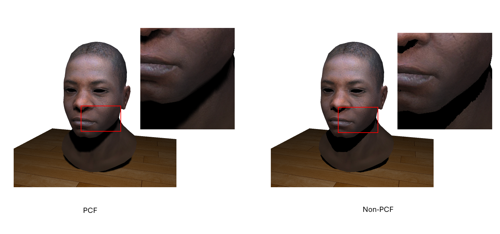
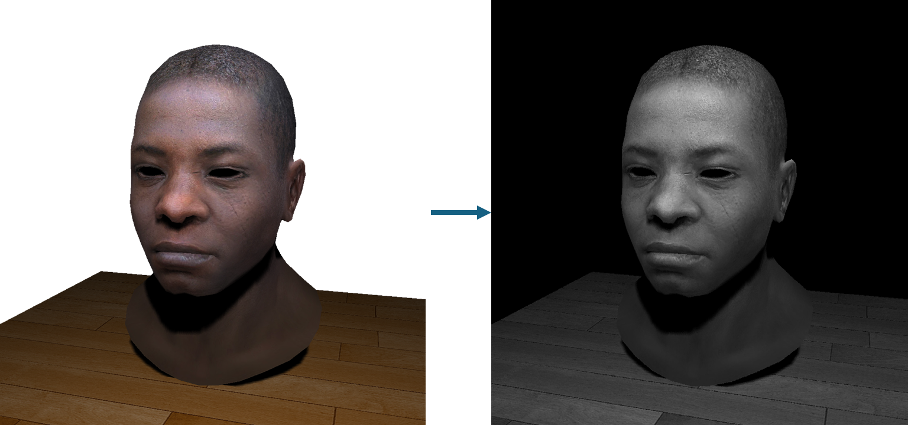

# SoftRender  
**A C++ Software Renderer Built from Scratch**

  
---

## 🚀 Project Motivation & Goals
- To **master the fundamentals of 3D graphics** by building a complete rasterization pipeline from the ground up.  
- To **architect a flexible, data-driven system** using modern C++ design patterns.  
- To **implement and debug classic, advanced rendering techniques** like dynamic shadows and post-processing effects.  
---

## 🧩 A Modern, Pass-Based Architecture
The renderer is built on a **modular pipeline**, where each frame is constructed by executing a sequence of self-contained render passes:
```
Scene Data → RenderContext → [Render Pass Loop: ShadowPass → LightingPass → PostFXPass] → Final Blit
```
This allows for unparalleled flexibility and extensibility.

---

## 🔁 The Power of a Generic Pipeline

```cpp
// The core rendering loop
void RenderSystem::tick() {
    RenderContext context;
    prepare_context(context);

    for (auto& pass : m_render_passes) {
        pass->execute(*this, context);
    }

    blit_to_screen(context.activeSceneTexture);
}
```

This clean architecture results in a **completely generic main loop**.  
New features can be added by simply inserting a pass into the queue—no changes to core engine code needed.

---


- A **flexible object-oriented lighting system** supports multiple, distinct light types.
- Currently implemented:
  - Point Lights
  - Directional Lights
  - Spotlights
- Extensible: new lights can be added by inheriting from the base `Light` class.

---

## 🌑 Feature: PCF Soft Shadow Mapping



- Implemented using a **two-pass shadow mapping** technique.
- **Percentage-Closer Filtering (PCF)** creates soft, realistic shadows with smooth edges.
- Eliminates the aliasing and artifacts of basic shadow mapping.

---

## ✨ Feature: Post-Processing Pipeline



The pass-based architecture enables **layered, modular post-processing**:
1. Grayness pass 
2. Brightness Pass  
3. Gaussian Blur  

Other planned/possible effects:   
✔️ Bloom Composite  
✔️ Color Grading  
✔️ Color Grading  
✔️ Screen Space Reflections  
✔️ Tone Mapping  
✔️ Vignette  

---

## 🧠 Key Challenges & Learnings

| Challenge | Learning |
|----------|----------|
| 🐛 Debugging shadow artifacts | Deepened understanding of coordinate spaces & frustums |
| 🧩 Designing pass/shader system | Evaluated trade-offs in C++ polymorphism vs. templates |
| 🚀 Optimizing performance | Applied data-oriented design & memory access patterns |

---

## 🔮 Future Work

- **🧱 Architecture**: Implement a full **Render Graph** with auto dependency resolution and multi-threaded dispatch.  
- **🎨 Materials**: Expand to a full **Physically Based Rendering (PBR)** workflow.  
- **🌫️ Features**: Support **transparent objects** and **alpha blending**.  
- **🛠️ Tooling**: Integrate a **Dear ImGui** UI for real-time debug & parameter tweaking.  

---

